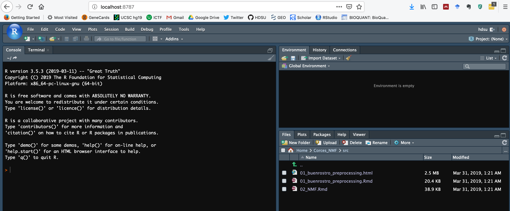

Combining and understanding multi-omics data
================
Carl Herrmann - <carl.herrmann@uni-heidelberg.de>
Allahabad RTG Summer School - April 2019

Lecture slides
--------------

You can find the pdf of the lecture slides in this repository. Feel free to get back to me for questions, suggestions (or errors!)

Tutorial
--------

This is a short tutorial on using the `Bratwurst` R-package implemented using the TensorFlow framework. There is a previous version of `Bratwurst` on GitHub (checkout [here](https://github.com/wurst-theke/bratwurst)). However, this older version uses CUDA (and not TensorFlow), and is way slower than the TensorFlow implementation provided in the Docker container!

In order to make the installation easier, we provide a `docker` container which contains Bratwurst as well as all the dependencies (for example the TensorFlow framework.)

### installing Docker

In order to run this container, **Docker desktop** is needed.

**MacOS and Windows**

You can download it freely from [this website](https://www.docker.com/products/docker-desktop).

*Be aware that you might need to enable virtualization in the Windows BIOS*. For Windows you should also install [VirtualBox](https://www.virtualbox.org/).

**Linux**

Check [these instructions](https://docs.docker.com/install/linux/docker-ce/ubuntu/).

### Running the docker container

Once Docker Desktop is installed, you can open a terminal (it is provided with the Windows version!) and type

    docker run --rm -p 8787:8787 -e USER=hdsu -e PASSWORD=pass andresquintero/bratwurst_example

Once this is done, you can go to a web browser, and type in the URL `localhost:8787`. A login page for RStudio opens; use the username `hdsu` and the password `pass`.

You should have something like this:

On the bottom right, go into the `Corces` directory, then into `src` and you will find the following files:

-   `01_buenrostro_preprocessing.Rmd` : R-code for the pre-processing of the RNA-seq/ATAC-seq data of the Corces et al. paper
-   `02_NMF.Rmd`: R markdown file with the tutorial.

Click on the `02_NMF.Rmd` file, and here you got...!
